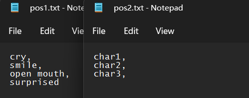
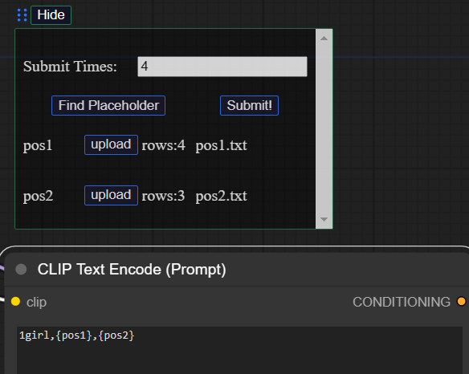
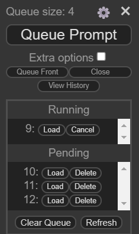
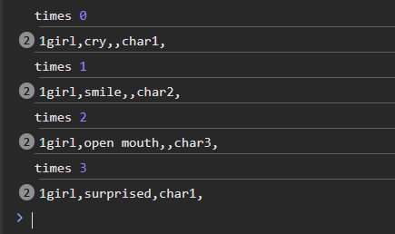

# Description

## Brief

an easy chrome extension to inject your word to prompt and queue prompt.
If you have many different prompt words for a same prompt, you can use it queue prompt easily.
For example, like <https://civitai.com/models/444414/gakuen-idolmaster-aio-lora>, there are different trigger words for 1 lora. It can easily replace the placeholder with your trigger words and queue prompt, if you want to make queue different characters' prompts.

## How to use and Result

Firstly, you should write your words in (.md) or (.txt).
Per time will replace the placeholder with one row. (You can see the images if you don't know how it works.)

After you installed the extensions, you can see the extension on the top-left corner of the page. Click the `Formatter` will open the dialog.
Write place holder on prompt with `{}` , like `{pos1}`(the placeholder should not be same).
After you write all of you placeholders, click `Find Placeholder`, and it show the available placeholder.
Upload your text file for placeholders respectively.
And then click `Submit!`

It will queue prompt will your text.
If the `Submit Times` > your rows, it will repeat from the first row. (Please see the result)

All the prompt queued like the image above. You can see that, the `{pos2}` only contains 3 rows but it runs 4 times. So it will repeat from the first row (`char1`).

## Next step

I am writing custom Lora and Checkpoints nodes that can be modify by text instead of choose the them. So that you can use this extension to replace the placeholders.

## Supplement

Because it costs $5 to "become a developer". I will upload the extension with package on the release instead of find it on the extension shop.